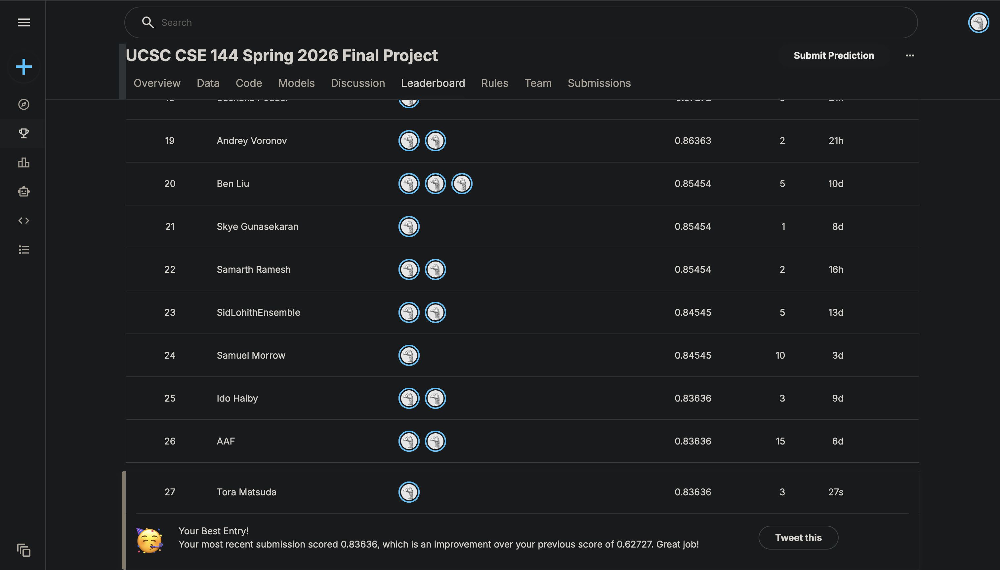

# CSE 144 Final Project: Transfer Learning for Image Classification


**Toranosuke Matsuda**  
**Model:** DINOv2 ViT-B/14 with two-stage fine-tuning  
**Final val accuracy:** 82.79%

---

## Kaggle Leaderboard



---

## Model Weights

Trained model checkpoints are available on Google Drive:

> **[Download model weights (Google Drive)]** (https://drive.google.com/drive/folders/1Jb-zm48YF6YPtw5YsyQuw36WcqM7N4Ny?usp=sharing)

The Drive folder contains:
- `best_stage1_dino.pt` — best Stage 1 checkpoint (backbone frozen, head only)
- `best_stage2_dino.pt` — best Stage 2 checkpoint (full fine-tune, used for inference)

Place both files in a `checkpoints/` directory at the project root before running inference.

---

## Repository Structure

```
.
├── CSE144_Final_Project_ViT.ipynb   # Main notebook (training + inference)
├── checkpoints/
│   ├── best_stage1_dino.pt          # Stage 1 checkpoint
│   └── best_stage2_dino.pt          # Stage 2 checkpoint (inference)
├── data/
│   ├── train/                       # 100 class folders, ~10 images each
│   │   ├── 0/
│   │   ├── 1/
│   │   └── ... (up to 99/)
│   └── test/                        # 1036 unlabeled test images
├── training_curves_vit.png          # Training/validation curves
├── report.pdf                       # Project report
├── submission.csv                   # Final Kaggle submission
└── README.md
```

---

## Environment Setup

### Requirements

```bash
pip install torch torchvision matplotlib tqdm scikit-learn pandas Pillow
```

### Verified environment

- Python 3.11+
- PyTorch 2.x
- macOS Apple Silicon (MPS) or CUDA GPU
- `NUM_WORKERS = 0` required on MPS (multiprocessing limitation with Jupyter)

---

## Running Training

Open `CSE144_Final_Project_ViT.ipynb` in VS Code or Jupyter Lab and run cells in order.

**Data setup:** Place the Kaggle dataset so the structure matches:
```
data/train/0/, data/train/1/, ..., data/train/99/
data/test/0.jpg, data/test/1.jpg, ..., data/test/1035.jpg
```

**Key configuration** (Cell 5 — config cell):
```python
TRAIN_DIR  = Path('./data/train')
TEST_DIR   = Path('./data/test')
CKPT_DIR   = Path('./checkpoints')
NUM_CLASSES = 100
IMG_SIZE    = 224
BATCH_SIZE  = 32
S1_EPOCHS   = 15    # Stage 1: frozen backbone
S1_LR       = 1e-3
S2_EPOCHS   = 20    # Stage 2: full fine-tune
S2_LR       = 1e-5  # Low LR to protect DINOv2 pretrained weights
```

**Training stages:**

- **Stage 1** (Cell 9): Freezes the DINOv2 backbone, trains only the 100-class classification head for 15 epochs at LR=1e-3. Saves `best_stage1_dino.pt`.
- **Stage 2** (Cell 10): Loads Stage 1 best checkpoint, unfreezes all layers, fine-tunes end-to-end for 20 epochs at LR=1e-5 with gradient clipping (max_norm=1.0). Saves `best_stage2_dino.pt`.

Total training time: approximately 30–60 minutes on Apple M5 Pro (MPS).

---

## Running Inference

To generate `submission.csv` from a pre-trained checkpoint without retraining:

1. Download `best_stage2_dino.pt` from Google Drive and place it in `checkpoints/`
2. Open the notebook and run only these cells in order:
   - Cell 2 (imports)
   - Cell 3 (set_seed)
   - Cell 5 (config)
   - Cell 7 (model definition)
   - Cell 12 (load best model)
   - Cell 13 (TTA inference → writes submission.csv)
   - Cell 14 (sanity checks)

The inference cell uses **Test Time Augmentation (TTA)** with 16 augmented passes per image and writes `submission.csv` with 1036 rows.

---

## Reproducibility

- Fixed random seed: `set_seed(42)` called before model initialization and Stage 1 training
- `torch.use_deterministic_algorithms(True)` enabled where supported
- `NUM_WORKERS = 0` for deterministic data loading on MPS
- Train/val split uses `torch.Generator().manual_seed(42)`
- Results may vary slightly across hardware (MPS vs CUDA vs CPU) due to floating point differences

**Expected reproducible results:**
- Stage 1 best val acc: ~76–78%
- Stage 2 best val acc: ~82–83%

---

## Model Architecture

| Component | Detail |
|-----------|--------|
| Backbone | DINOv2 ViT-B/14 (86M params) |
| Pretrained on | 142M diverse images (self-supervised) |
| Input size | 224 × 224 |
| Head | Dropout(0.5) + Linear(768, 100) |
| Fine-tuning | Two-stage: head-only → full |

## Hyperparameters

| Parameter | Stage 1 | Stage 2 |
|-----------|---------|---------|
| LR | 1e-3 | 1e-5 |
| Epochs | 15 | 20 |
| Batch size | 32 | 32 |
| Optimizer | Adam | Adam |
| Scheduler | Cosine Annealing | Cosine Annealing |
| Weight decay | 1e-4 | 1e-4 |
| Label smoothing | 0.1 | 0.1 |
| Grad clip | 1.0 | 1.0 |
